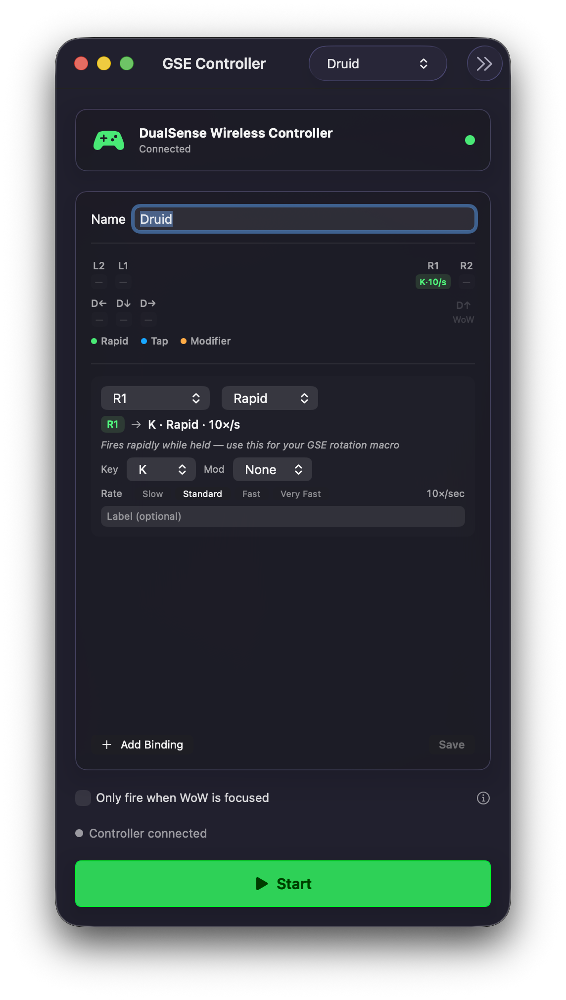

# GSEController

A macOS app that turns your PS5 (or Xbox) controller into a rapid-fire keyboard macro trigger for World of Warcraft — designed for use with [GSE (GnomeSequencer Enhanced)](https://www.curseforge.com/wow/addons/gse-gnome-sequencer-enhanced-advanced-macros).

Hold a button → the app spams your macro key at a configurable rate. D-pad buttons can hold modifier keys (Alt/Shift/Ctrl) to activate modifier blocks inside your GSE rotation.



## Features

- **Multiple profiles** — one per class/spec, switch from the toolbar
- **Per-button configuration** — assign any controller button to any key
- **Three fire modes:**
  - **Rapid** — spams the key while held (for GSE rotation macros)
  - **Tap** — fires once per press (for manual cooldowns)
  - **Modifier** — holds Alt/Shift/Ctrl while pressed (activates GSE modifier blocks)
- **Configurable rate** — 6/10/15/20 presses per second, or custom
- **Controller map** — visual overview of all your bindings at a glance
- **WoW focus guard** — optionally only fires when WoW is the active window
- **Profile templates** — pre-built setups for Guardian Druid, Tank, Melee DPS, Ranged/Caster, Healer

## Requirements

- macOS 26 Tahoe (currently in beta — not yet available on stable macOS releases)
- Xcode 16+ (to build)
- A PS5 DualSense or Xbox controller connected via USB or Bluetooth
- Accessibility permission (to send key events to WoW)

## Installation

```bash
git clone https://github.com/jcll/GSEController.git
cd GSEController
./install.sh
```

`install.sh` builds a Release binary and copies it to `/Applications/GSEController.app`.

On first launch, macOS will ask for Accessibility permission — this is required for the app to send keystrokes to WoW.

## Building manually

```bash
xcodebuild -scheme GSEController -destination 'platform=macOS' build
```

## Running tests

```bash
xcodebuild test -project GSEController.xcodeproj -scheme GSEController -destination 'platform=macOS,arch=arm64'
```

29 unit tests covering `Models`, `FireEngine`, and `KeySimulator` pure logic. No mocking infrastructure — tests run entirely in-process via `TEST_HOST`/`BUNDLE_LOADER`.

## Setup guide

1. Launch GSEController and connect your controller
2. Click **+** and pick a profile template (or start blank)
3. For each binding, set the button, mode, and key to match your GSE macro keybind
4. Click **Save**, then click **Start**
5. In WoW, make sure the key you configured is bound to your GSE macro

### ConsolePort users

If you use ConsolePort alongside this app:
- Unbind the trigger button in ConsolePort so it doesn't double-fire
- Or use L3/R3 as your trigger — ConsolePort rarely binds those by default
- D-pad directions used for Modifier mode will also fire as native WoW gamepad inputs — unbind them in ConsolePort, or accept the double-fire

## How it works

The app uses Apple's GameController framework to read controller input. Key events are sent via a small helper binary (`KeyHelper`) that is compiled from source at runtime — this allows it to hold the Accessibility permission separately from the sandboxed main app.

## Security model

GSEController has an unusual architecture that security-conscious users should understand before installing:

- **No sandbox:** The app runs without the macOS app sandbox. This is required to compile and launch the KeyHelper binary at runtime. It means the app has unrestricted filesystem and process access under your user account.

- **Runtime C compilation:** On first launch, the app compiles a small C program (`KeyHelper`) using `/usr/bin/cc` and stores the binary at `~/Library/Application Support/GSEController/keyhelper`. The source is embedded in `KeySimulator.swift` — you can audit it before building.

- **Persistent launchd agent:** The helper is registered as a launchd user agent that starts at login and stays running in the background. It receives key events from the main app via a FIFO in your per-user temp directory and posts them via `CGEventPost`.

- **Accessibility permission:** The helper binary (not the main app) holds the Accessibility permission used to send keystrokes. This is standard practice for apps that need to send events to other applications.

If you have concerns about any of this, you can review the full source at [github.com/jcll/GSEController](https://github.com/jcll/GSEController) before building.

## License

MIT — see [LICENSE](LICENSE)
